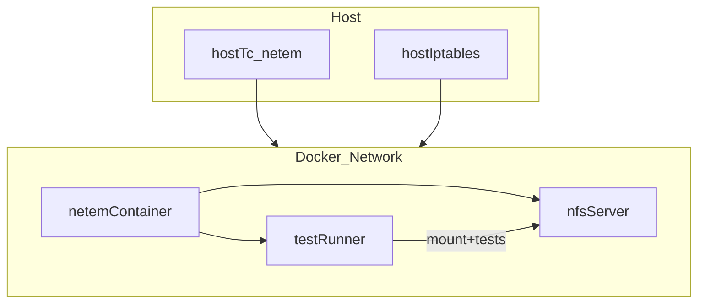

# Off‑Nominal NFS Test Plan

## Goals

- Add controlled fault injection (network and NFS misconfig) in Docker and host environments.
- Ensure the test suite **detects** faults (expected failures) and reports them clearly in the existing report outputs.
- Keep default “happy‑path” runs unchanged; off‑nominal runs are explicit and opt‑in.

## Scope & Strategy

- **Network faults**: latency, packet loss, jitter, reordering, bandwidth caps, temporary blackholes, and mid‑transfer disconnects.
- **NFS misconfigs**: wrong export path, read‑only export, wrong NFS version, root_squash, no lockd, auth mismatch.
- **Server faults**: server restarts during I/O, export reloads, stale file handles.
- **Resource faults**: disk‑full simulation, inode exhaustion, file‑count limits.
- **Detection**: add negative tests that assert specific failures and capture diagnostic signals in reports.

## Architecture (Fault Injection Overview)



## Implementation Plan

### 1) Add “Fault Profiles” Configuration

- Create a clear config scheme for fault scenarios using env vars and profile files.
- **Files**:
  - Add `faults/` directory with per‑scenario YAML or shell config (e.g., `faults/network_loss_10.yaml`, `faults/nfs_ro_export.yaml`).
  - Update `README.md` to document how to run each fault scenario.
  - Update `TEST_PLAN.md` to include off‑nominal coverage matrix.

### 2) Docker‑Native Network Fault Injection (netem)

- Add a **netem** sidecar container that applies `tc netem` to the docker bridge or specific container veths.
- Use a profile such as `--profile faults` to keep defaults unchanged.
- **Files**:
  - Update `docker-compose.yml` to include a `netem` service with CAP_NET_ADMIN and a command to apply a specified fault profile.
  - Add `faults/apply_netem.sh` to parse a fault profile and apply tc settings.

### 3) Host‑Level Network Fault Injection

- Provide optional host scripts to apply `tc netem` on docker interface and iptables rules.
- **Files**:
  - Add `faults/host_netem.sh` to apply latency/loss/jitter/blackhole on docker bridge.
  - Add `faults/host_iptables.sh` for port blocking (e.g., 2049) to simulate server unreachable.

### 4) NFS Misconfiguration Scenarios

- Add alternate `exports` configs and environment variations.
- **Examples**:
  - Wrong export path (`/data` missing)
  - Read‑only export
  - NFS version mismatch (client uses v3 vs server v4)
  - root_squash enabled to break permission tests
  - lockd disabled for locking tests
- **Files**:
  - Add `faults/exports_ro` and `faults/exports_badpath`.
  - Add optional `docker-compose.override.yml` for misconfig profile.

### 5) Add “Negative Tests” That Assert Failure

- Add tests that **expect failure** under specific fault scenarios and verify error messages.
- Mark them with a new marker, e.g. `@pytest.mark.off_nominal`.
- **Files**:
  - Add `tests/test_off_nominal_network.py`
  - Add `tests/test_off_nominal_nfs.py`
  - Add `tests/test_off_nominal_server.py`
  - Add `tests/test_off_nominal_resource.py`
  - Update `pytest.ini` with new marker(s).

### 6) Add “Failure Diagnosis” Reporting

- Extend report summary to include:
  - Fault profile name
  - Expected failure count vs actual
  - Failure class (network vs NFS vs server vs resource)
  - Heuristic diagnosis hints (e.g., “timeout during write -> likely packet loss/latency”)
- Add a small post‑processing step to parse test output and emit:
  - **Failure taxonomy** (timeouts, permission denied, stale file handle, mount failures)
  - **Suspicion mapping**: likely root cause based on error signatures
  - **Correlation**: slow throughput + disconnects -> suspected packet loss/jitter
- **Files**:
  - Update `tests/run_tests.sh` to include `FAULT_PROFILE` in reports and export `FAULT_CLASS`.
  - Add `tests/diagnose_failures.py` (parses JSON/text reports and emits diagnosis summary).
  - Add JSON summary fields for fault scenarios and diagnosis.

### 7) Reporting Enhancements for Fault Runs

- Extend report summary to include:
  - Fault profile name
  - Expected failure count vs actual
  - Specific failure messages captured
  - Performance deltas vs baseline (if available)
  - Issue indicators (disconnects + poor throughput -> packet loss/jitter)
- **Files**:
  - Update `tests/run_tests.sh` to include `FAULT_PROFILE` in reports.
  - Add JSON summary fields for fault scenarios.
  - Add `reports/baselines/` support for comparing to last baseline.

## Execution Examples

### Docker‑native faults

```bash
FAULT_PROFILE=network_loss_10 docker-compose --profile faults up --build --abort-on-container-exit
```

### Host‑level faults

```bash
sudo faults/host_netem.sh apply network_loss_10
make test
sudo faults/host_netem.sh clear
```

### NFS misconfig

```bash
FAULT_PROFILE=nfs_ro_export docker-compose --profile faults up --build --abort-on-container-exit
```

## Validation Matrix

| Fault Type | Expected Detection | Test(s) | Signal |

|---|---|---|---|

| Packet loss | Mount timeout or IO errors | `test_off_nominal_network.py` | Timeout/IO error signatures |

| Latency | Slow test duration | `test_off_nominal_network.py` | Duration threshold |

| Mid‑transfer disconnect | Partial writes/IO errors | `test_off_nominal_network.py` | EIO/timeout mid‑test |

| Read‑only export | Write fails | `test_off_nominal_nfs.py` | `PermissionError` |

| Wrong export | Mount fails | `test_off_nominal_nfs.py` | `No such file` |

| Version mismatch | Mount fails | `test_off_nominal_nfs.py` | NFS version error |

| Server restart | Stale file handle | `test_off_nominal_server.py` | ESTALE |

| Disk full | Write fails | `test_off_nominal_resource.py` | ENOSPC |

| Inode exhaustion | File create fails | `test_off_nominal_resource.py` | ENOSPC/EDQUOT |

## Files to Change/Add

- `docker-compose.yml`
- `README.md`
- `TEST_PLAN.md`
- `pytest.ini`
- `tests/run_tests.sh`
- `tests/test_off_nominal_network.py`
- `tests/test_off_nominal_nfs.py`
- `tests/test_off_nominal_server.py`
- `tests/test_off_nominal_resource.py`
- `faults/apply_netem.sh`
- `faults/host_netem.sh`
- `faults/host_iptables.sh`
- `faults/*.yaml`
- `tests/diagnose_failures.py`
- `reports/baselines/` (optional)

## Success Criteria

- Off‑nominal scenarios are opt‑in and do not break normal runs.
- Each fault profile triggers an expected and **verified** failure.
- Reports include fault profile metadata, failure reasons, and diagnosis hints.
- Both Docker‑native and host‑level fault injection paths documented and usable.