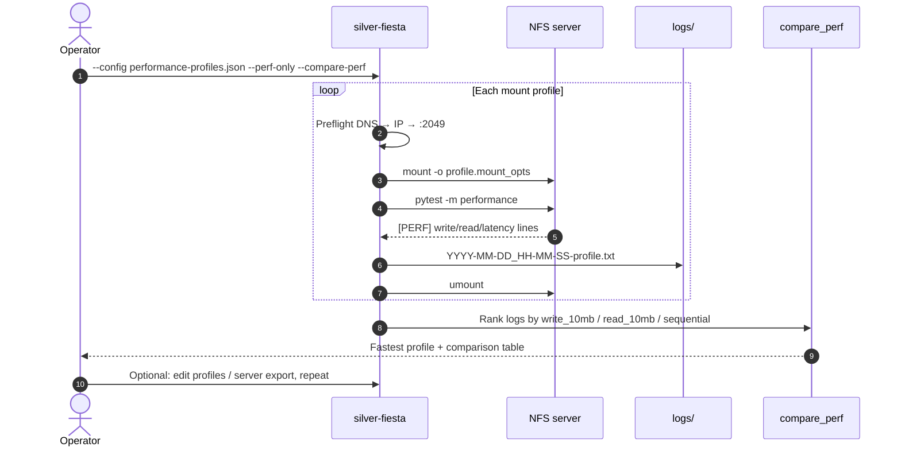

# Silver-fiesta

Client-side NFS probe. Mount a share from this machine, run a focused pytest suite, and **always** save a log named `YYYY-MM-DD_HH-MM-SS-<server>.txt`.

Use it before pointing backups or sync jobs at a NAS, or when debugging mount and write issues.

## Quick start

**Prerequisites:** NFS client tools (`nfs-common`), Python 3, pytest deps, and **sudo** (mount requires root).

```bash
python3 -m venv .venv
.venv/bin/pip install -r tests/requirements.txt
chmod +x silver-fiesta

sudo ./silver-fiesta 192.168.50.51
sudo ./silver-fiesta nas.local:/exports/backup
```

Each run writes a log under `logs/`, for example:

```text
logs/2026-07-01_14-30-00-192.168.50.51.txt
```

A full annotated example is in [`docs/samples/silver-fiesta-probe-sample.txt`](docs/samples/silver-fiesta-probe-sample.txt).

## Sample output

Terminal output from a successful probe (`sudo ./silver-fiesta nas.local`):

```text
Silver-fiesta NFS probe
Target: nas.local
Mount: nas.local:/
Options: vers=4,proto=tcp
Log: logs/2026-07-01_14-30-00-nas.local.txt
========================================================================
┌──────────────────────────────────────────────────────────────────────┐
│ ✓ DNS / Hostname [OK]                                                │
├──────────────────────────────────────────────────────────────────────┤
│ Resolved nas.local → 192.168.50.51                                   │
│   • getent: 192.168.50.51 nas.local                                  │
│   host: nas.local                                                    │
│   ip: 192.168.50.51                                                  │
└──────────────────────────────────────────────────────────────────────┘

┌──────────────────────────────────────────────────────────────────────┐
│ ✓ IP Reachability [OK]                                               │
├──────────────────────────────────────────────────────────────────────┤
│ Host responds at 192.168.50.51                                       │
│   • ping: host replied                                               │
│   target: 192.168.50.51                                              │
└──────────────────────────────────────────────────────────────────────┘

┌──────────────────────────────────────────────────────────────────────┐
│ ✓ NFS Service Port (2049) [OK]                                       │
├──────────────────────────────────────────────────────────────────────┤
│ Port 2049 reachable on 192.168.50.51                                 │
│   • TCP 192.168.50.51:2049 open                                      │
│   port: 2049                                                         │
└──────────────────────────────────────────────────────────────────────┘

Running tests (log -> logs/2026-07-01_14-30-00-nas.local.txt)...
Mounting NFS share nas.local:/ with options: vers=4,proto=tcp
Mount successful. Running tests...
Running tests as tprettol with: .venv/bin/pytest

================================================================================
Running test: test_basic_io::test_file_create_read_write
================================================================================
[TEST COMPLETE] tests/test_basic_io.py::test_file_create_read_write: PASSED (0.042s)

======================== 64 passed, 2 skipped in 12.4s =========================

[PASS] nas.local (exit 0) -> logs/2026-07-01_14-30-00-nas.local.txt
```

When preflight fails (bad hostname), panels show which layer broke:

```text
┌──────────────────────────────────────────────────────────────────────┐
│ ✗ DNS / Hostname [FAIL]                                              │
├──────────────────────────────────────────────────────────────────────┤
│ Cannot resolve definitely-not-a-real-nfs-host.invalid                │
│   • getent failed (rc=2)                                             │
│   • DNS resolution failed: [Errno -2] Name or service not known      │
├──────────────────────────────────────────────────────────────────────┤
│ → Verify service name, /etc/hosts, or Docker network DNS.            │
└──────────────────────────────────────────────────────────────────────┘

[FAIL] definitely-not-a-real-nfs-host.invalid (exit 1) -> logs/2026-07-01_14-31-00-....txt
```

Use `--preflight-only` to run just the connectivity ladder without mounting.

## Sample log file

Every run appends the full session to the dated log — preflight panels, mount messages, and complete pytest output. See [`docs/samples/silver-fiesta-probe-sample.txt`](docs/samples/silver-fiesta-probe-sample.txt):

```text
Silver-fiesta NFS probe
Target: nas-primary
Mount: 192.168.50.51:/
Options: vers=4,proto=tcp
Log: logs/2026-07-01_14-30-00-192.168.50.51.txt
========================================================================

--- Preflight ---
┌──────────────────────────────────────────────────────────────────────┐
│ ✓ DNS / Hostname [OK]                                                │
...
Mount successful. Running tests...
[TEST COMPLETE] tests/test_basic_io.py::test_file_create_read_write: PASSED (0.042s)
...
======================== 64 passed, 2 skipped in 12.4s =========================
```

## Config file (multiple servers / versions)

Pass a JSON config to test several targets in one invocation — different hosts, exports, or NFS versions:

```bash
sudo ./silver-fiesta --config config/example.json
sudo ./silver-fiesta --config my-lab.json --list-targets   # preview only
```

Example `config/example.json`:

```json
{
  "log_dir": "logs",
  "defaults": {
    "nfs_version": "4",
    "mount_opts": "vers=4,proto=tcp",
    "mount_point": "/tmp/nfs_test_mount"
  },
  "targets": [
    { "name": "nas-primary", "host": "192.168.50.51", "export": "/" },
    {
      "name": "nas-backup-v3",
      "host": "192.168.50.52",
      "export": "/mnt/backup",
      "nfs_version": "3",
      "mount_opts": "vers=3,proto=tcp,nolock"
    }
  ]
}
```

| Field | Purpose |
|-------|---------|
| `log_dir` | Where per-run logs are written (default: `logs/`) |
| `defaults` | Shared `nfs_version`, `mount_opts`, `mount_point`, `test_user` (and `host`/`export` for profiles) |
| `targets[]` | Each server: `host`, `export`, optional `name`, overrides |
| `profiles[]` | Mount-option variants for one host — see [Performance tuning loop](#performance-tuning-loop) |

CLI flags (`--nfs-version`, `--mount-opts`, `--mount-point`, `--log-dir`) apply to a single-server run and override defaults when using `--config`.

## Performance tuning loop

Use mount-option **profiles** to connect → test → remount with new opts → test → compare, and pick the fastest client config for your NAS.

1. Edit `config/performance-profiles.json` — set `defaults.host` / `defaults.export` to your share.
2. Preview: `sudo ./silver-fiesta --config config/performance-profiles.json --list-targets`
3. Sweep (perf tests only, then rank):

```bash
sudo ./silver-fiesta --config config/performance-profiles.json --perf-only --compare-perf
# or
make perf-sweep PERF_CONFIG=config/performance-profiles.json
```

4. Re-rank saved logs later without remounting:

```bash
./scripts/compare_perf.py logs/*-large-io-1m.txt logs/*-baseline-v4.txt
# or
make perf-compare LOGS='logs/2026-07-19_*-baseline*.txt logs/2026-07-19_*-large-io*.txt'
```

Bundled profiles (from common NFS client tweaks):

| Profile | Mount options focus |
|---------|---------------------|
| `baseline-v4` | `vers=4,proto=tcp,hard` |
| `large-io-1m` | `rsize=1048576,wsize=1048576` |
| `large-io-64k` | `rsize=65536,wsize=65536` |
| `cache-actimeo-60` | attribute cache `actimeo=60` |
| `cache-nocto` | `nocto` (read-mostly only) |
| `resilient-timeouts` | `timeo=600,retrans=5` |
| `nfsv3-tcp` / `nfsv3-nolock-64k` | NFSv3 comparison |

Server-side knobs (nfsd threads, `sync`/`async` exports, jumbo frames, TCP buffers) are outside this client probe — change them on the NAS, then re-run the same sweep to compare.

See [docs/NFS_PERFORMANCE_TUNING.md](docs/NFS_PERFORMANCE_TUNING.md) for the full client vs server knob map.



## What gets tested

The probe runs **64+ pytest cases** against the mounted share. Tests run as your normal user (not root) so `root_squash` behavior matches real clients.

| Module | Checks |
|--------|--------|
| `test_basic_io` | Create, read, write, append, directories, ~1MB files |
| `test_data_integrity` | CRC32 across sizes and data patterns |
| `test_advanced` | `chmod`, file locking (`fcntl`) |
| `test_concurrent` | Multi-process writes to separate files |
| `test_metadata` | `mtime` / `utime` behavior |
| `test_performance` | Write/read throughput and latency |
| `test_off_nominal_*` | Fault scenarios when run in container harness (see [TESTING.md](TESTING.md)) |

**v2 additions:** DNS → IP → port **preflight** with IxDF panels, SignOz-compatible **OTLP tracing**, and **incident bundles** (`*-incident.json`) for AI troubleshooting. See [TESTING.md](TESTING.md#v2-preflight-observability-and-incident-bundles).

**Skipped or environment-dependent:** locking without `lockd`, some permission checks when running as root in containers.

## Options

```text
sudo ./silver-fiesta [host|host:/export] [options]

  -c, --config PATH       JSON config with targets and/or profiles
  --export PATH           Export when host has no :/path (default: /)
  --nfs-version VER       NFS version (default: 4)
  --mount-opts OPTS       Mount options (default: vers=4,proto=tcp)
  --mount-point PATH      Local mount (default: /tmp/nfs_test_mount)
  --test-user USER        Run pytest as USER (default: SUDO_USER)
  --log-dir PATH          Log directory (default: logs/)
  --list-targets          Print targets/profiles from config and exit
  --preflight-only        Run DNS → IP → port checks and exit
  --skip-preflight        Skip preflight (mount immediately)
  --perf-only             Run only pytest -m performance
  --compare-perf          After multi-profile run, rank [PERF] results
  --compare-logs FILES    Compare existing logs (no mount)
  --compare-metric NAME   write_10mb | read_10mb | sequential
```

## Troubleshooting

| Symptom | Likely cause |
|---------|----------------|
| `mounting NFS requires root` | Re-run with `sudo` |
| Cannot create directories on share | `root_squash` — tool already runs pytest as your user; fix export ACLs on the server |
| Export not in `showmount` list | Wrong path; script prints available exports |
| `pytest not found` | Install deps: `.venv/bin/pip install -r tests/requirements.txt` |

Low-level runner (used internally): `tests/standalone_test.sh`.

## Container-based development

To spin up local NFS servers in Docker/Podman, run the full in-repo harness, fault injection, and HTML/JSON reports, see **[TESTING.md](TESTING.md)**.

## Integration

[bookish-train](https://github.com/mowgli42/bookish-train) can call this repo via `nfs_smoke` / `nfs_full` protocol probes during backup triage.
