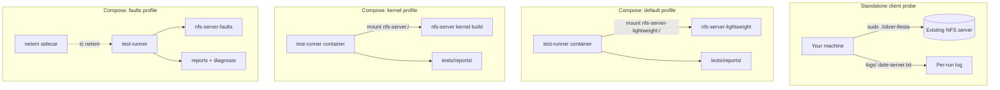
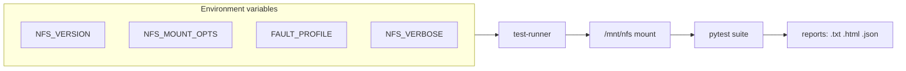

# Silver-fiesta — container test harness

This document covers **in-repo NFS server testing**: Docker/Podman compose stacks, fault injection, and rich reports. For probing a real NAS from your laptop or backup host, use the standalone tool in [README.md](README.md).

## Test configurations



### Configuration matrix

| Mode | Command | NFS server | Use when |
|------|---------|------------|----------|
| **Standalone** | `sudo ./silver-fiesta <host>` | Your NAS / lab server | Pre-flight before backups; real network |
| **Lightweight** | `make test` | `erichough/nfs-server` image | Fast CI; no image build |
| **Kernel** | `make test-kernel` | Alpine + `nfs-utils` | Production-like server behavior |
| **Verbose** | `make test-verbose` | Either + debug logs | Debugging server-side ops |
| **Faults** | `FAULT_PROFILE=... compose --profile faults` | Misconfigured or stressed server | Regression on failure handling |



## Prerequisites

- Docker or Podman + compose
- NFS kernel modules on the **host** (both server profiles need them):

```bash
sudo modprobe nfs nfsd
```

Persistent load: add `nfs` and `nfsd` to `/etc/modules-load.d/nfs.conf`.

## Setup

```bash
python3 -m venv .venv
.venv/bin/pip install -r tests/requirements.txt
chmod +x scripts/container-compose.sh
./scripts/container-compose.sh config -q
```

## Running the harness

```bash
make test              # lightweight server (default)
make test-kernel       # kernel-based server
make test-verbose      # NFS_VERBOSE + DEBUG logging
make config            # validate compose file
make clean             # tear down volumes/networks
```

Or directly:

```bash
./scripts/container-compose.sh --profile default up --build --abort-on-container-exit
./scripts/container-compose.sh --profile kernel up --build --abort-on-container-exit
```

### Runner environment

| Variable | Default | Notes |
|----------|---------|-------|
| `NFS_SERVER` | `nfs-server-lightweight` | Compose service hostname |
| `NFS_SERVER_TYPE` | `lightweight` | Report label |
| `NFS_VERSION` | `4` | Passed to mount |
| `NFS_MOUNT_OPTS` | `vers=4,proto=tcp` | Full mount option string |
| `NFS_MOUNT_POINT` | `/mnt/nfs` | Inside test-runner |
| `NFS_VERBOSE` | unset | Enable server debug logging |
| `FAULT_PROFILE` | unset | See fault section below |

## NFS export layout

Both in-container servers export `/data` with `fsid=0`. Clients mount `server:/` (root), which maps to `/data` — standard single-export NFSv4 style.

- **Kernel server:** exports `/data` from the container filesystem
- **Lightweight server:** exports `/data` on volume `nfs-data`

## Reports

After a compose run, artifacts land in `tests/reports/`:

| File | Contents |
|------|----------|
| `<timestamp>-<server-type>.txt` | Full console output |
| `...html` | Self-contained pytest HTML |
| `...json` | Machine-readable results |
| `...-summary.txt` | Pass/fail counts, slow tests |
| `...-performance.txt` | Throughput / latency extract |
| `...-diagnosis.txt` | Fault-run root-cause hints |

Standalone client logs use `logs/YYYY-MM-DD_HH-MM-SS-<server>.txt` instead (see README).

## Off-nominal / fault testing

Fault scenarios are opt-in via compose `--profile faults`.

### Network faults (Docker netem sidecar)

```bash
FAULT_PROFILE=network_loss_10 ./scripts/container-compose.sh --profile faults up --build --abort-on-container-exit
FAULT_PROFILE=network_latency_200 ./scripts/container-compose.sh --profile faults up --build --abort-on-container-exit
FAULT_PROFILE=network_blackhole ./scripts/container-compose.sh --profile faults up --build --abort-on-container-exit
```

### Host-level netem (against external server)

```bash
sudo faults/host_netem.sh apply network_loss_10
make test
sudo faults/host_netem.sh clear
```

### NFS misconfiguration faults

```bash
FAULT_PROFILE=nfs_ro_export FAULT_EXPORTS=exports_ro \
  ./scripts/container-compose.sh --profile faults up --build --abort-on-container-exit
```

| Profile | Expected signal |
|---------|-----------------|
| `network_loss_10` | Lower throughput, timeouts |
| `network_latency_200` | Slow tests |
| `network_blackhole` | Mount failure |
| `nfs_ro_export` | Write `PermissionError` |
| `nfs_badpath` | Mount failure |
| `nfs_root_squash` | Permission test differences |

## Verbose server logging

```bash
NFS_VERBOSE=true ./scripts/container-compose.sh --profile kernel up --build
docker logs -f nfs-server
```

Kernel server logs individual NFS operations; lightweight server logs via container stdout.

## Repository layout

```text
silver-fiesta/           # ./silver-fiesta — client probe CLI
silver_fiesta.py         # CLI implementation
config/example.json      # Multi-target config sample
tests/
  standalone_test.sh     # Mount + pytest (standalone)
  run_tests.sh           # In-container runner + reports
  test_*.py              # Pytest modules
  reports/               # Compose run output
nfs-server/              # Kernel server image
docker-compose.yml       # Profiles: default, kernel, faults
faults/                  # Host netem helper
Makefile
```

## Troubleshooting compose runs

**NFS modules missing**

```text
ERROR: NFS kernel modules are not loaded on this host.
```

Run `sudo modprobe nfs nfsd` and retry.

**Stuck containers**

```bash
docker rm -f test-runner nfs-server-lightweight nfs-server
make clean
```

**Network not found**

```bash
make clean
docker network prune -f
```

## Standalone script (advanced)

Equivalent to the CLI internals:

```bash
sudo ./tests/standalone_test.sh 192.168.50.51
sudo ./tests/standalone_test.sh 192.168.50.51:/mnt/share
sudo NFS_VERSION=3 NFS_MOUNT_OPTS=vers=3,proto=tcp,nolock ./tests/standalone_test.sh nas
```

Prefer `./silver-fiesta` for automatic log naming and config-driven runs.
