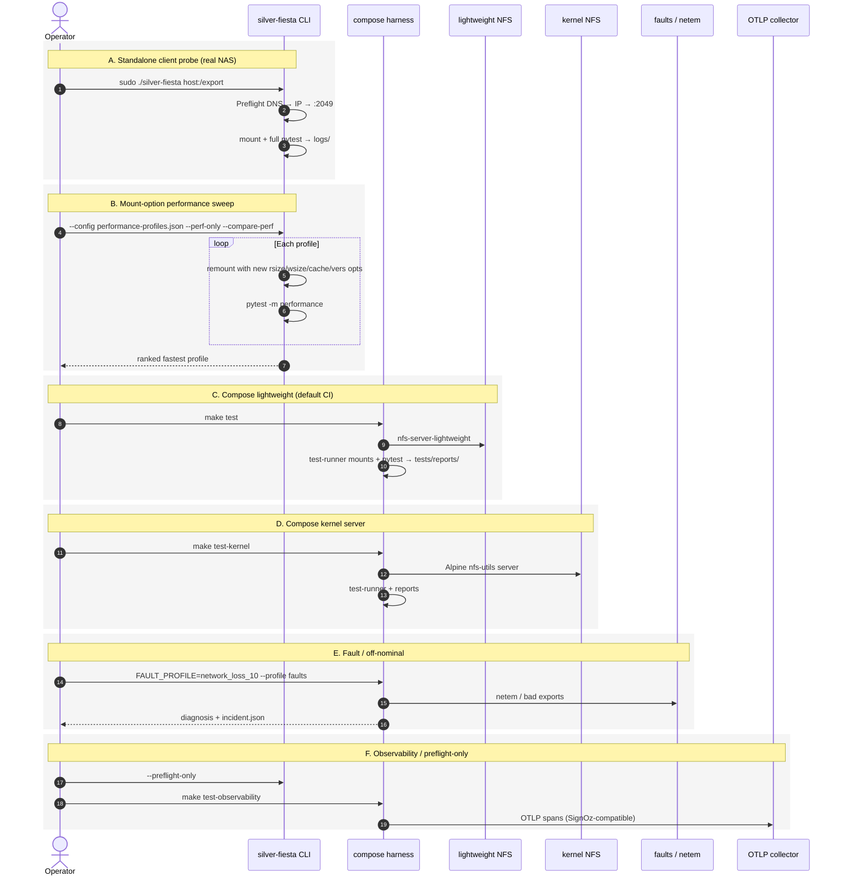
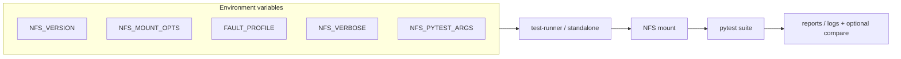
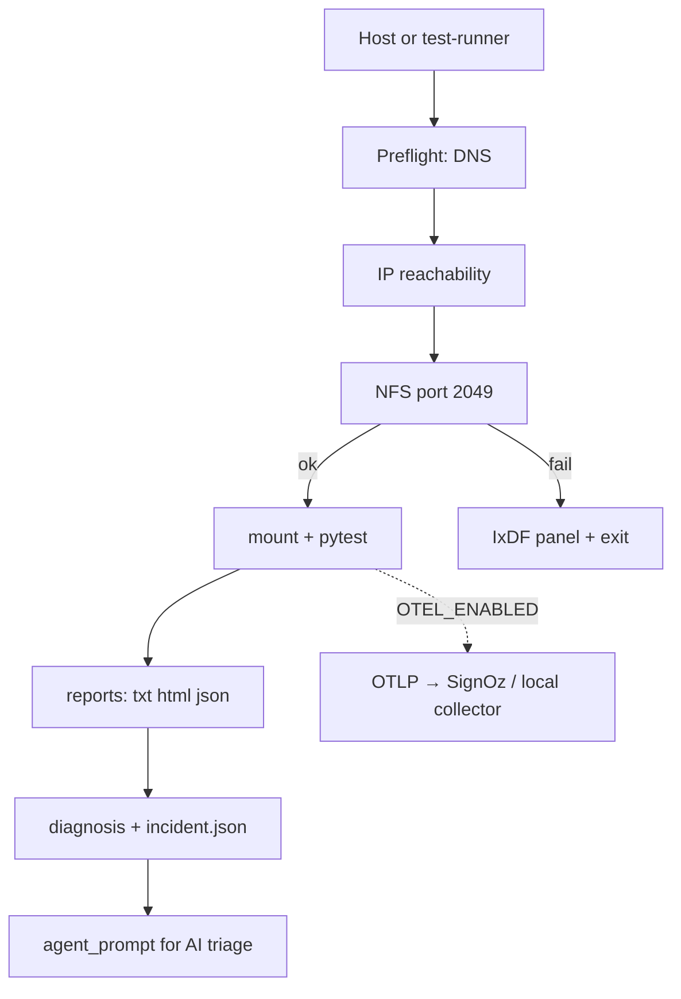

# Silver-fiesta — container test harness

This document covers **in-repo NFS server testing**: Docker/Podman compose stacks, fault injection, and rich reports. For probing a real NAS from your laptop or backup host, use the standalone tool in [README.md](README.md).

## Testing methods (sequence overview)


```mermaid
sequenceDiagram
  autonumber
  actor Op as Operator
  participant SF as silver-fiesta CLI
  participant Comp as compose harness
  participant LW as lightweight NFS
  participant KN as kernel NFS
  participant Fault as faults / netem
  participant Obs as OTLP collector

  rect rgb(245,245,245)
    note over Op,SF: A. Standalone client probe (real NAS)
    Op->>SF: sudo ./silver-fiesta host:/export
    SF->>SF: Preflight DNS → IP → :2049
    SF->>SF: mount + full pytest → logs/
  end

  rect rgb(245,245,245)
    note over Op,SF: B. Mount-option performance sweep
    Op->>SF: --config performance-profiles.json --perf-only --compare-perf
    loop Each profile
      SF->>SF: remount with new rsize/wsize/cache/vers opts
      SF->>SF: pytest -m performance
    end
    SF-->>Op: ranked fastest profile
  end

  rect rgb(245,245,245)
    note over Op,LW: C. Compose lightweight (default CI)
    Op->>Comp: make test
    Comp->>LW: nfs-server-lightweight
    Comp->>Comp: test-runner mounts + pytest → tests/reports/
  end

  rect rgb(245,245,245)
    note over Op,KN: D. Compose kernel server
    Op->>Comp: make test-kernel
    Comp->>KN: Alpine nfs-utils server
    Comp->>Comp: test-runner + reports
  end

  rect rgb(245,245,245)
    note over Op,Fault: E. Fault / off-nominal
    Op->>Comp: FAULT_PROFILE=network_loss_10 --profile faults
    Comp->>Fault: netem / bad exports
    Comp-->>Op: diagnosis + incident.json
  end

  rect rgb(245,245,245)
    note over Op,Obs: F. Observability / preflight-only
    Op->>SF: --preflight-only
    Op->>Comp: make test-observability
    Comp->>Obs: OTLP spans (SignOz-compatible)
  end
```

| Method | Command | When to use |
|--------|---------|-------------|
| **Standalone** | `sudo ./silver-fiesta <host>` | Real NAS / lab; pre-backup smoke |
| **Perf sweep** | `make perf-sweep` | Find fastest client mount options |
| **Lightweight** | `make test` | Fast local CI; no image build |
| **Kernel** | `make test-kernel` | Production-like nfsd behavior |
| **Verbose** | `make test-verbose` | Debug server-side ops |
| **Faults** | `FAULT_PROFILE=... --profile faults` | Failure-handling regressions |
| **Preflight** | `--preflight-only` / `make test-preflight` | Connectivity ladder only |
| **Observability** | `make test-observability` | OTLP traces + incident bundles |

## Test configurations

```mermaid
flowchart TB
  subgraph standalone["Standalone client probe"]
    C1[Your machine]
    C1 -->|sudo ./silver-fiesta| NAS1[(Existing NFS server)]
    C1 -->|logs/ date-server.txt| LOG1[Per-run log]
  end

  subgraph perf["Performance profile sweep"]
    C2[Your machine]
    C2 -->|profiles[].mount_opts| NAS2[(Same NFS server)]
    C2 --> CMP[compare_perf ranking]
  end

  subgraph compose_default["Compose: default profile"]
    TR1[test-runner container]
    LW[nfs-server-lightweight]
    TR1 -->|mount nfs-server-lightweight:/| LW
    TR1 --> R1[tests/reports/]
  end

  subgraph compose_kernel["Compose: kernel profile"]
    TR2[test-runner container]
    KS[nfs-server kernel build]
    TR2 -->|mount nfs-server:/| KS
    TR2 --> R2[tests/reports/]
  end

  subgraph compose_faults["Compose: faults profile"]
    TR3[test-runner]
    NF[nfs-server-faults]
    NE[netem sidecar]
    TR3 --> NF
    NE -.->|tc netem| TR3
    TR3 --> R3[reports + diagnosis]
  end
```

### Configuration matrix

| Mode | Command | NFS server | Use when |
|------|---------|------------|----------|
| **Standalone** | `sudo ./silver-fiesta <host>` | Your NAS / lab server | Pre-flight before backups; real network |
| **Perf sweep** | `make perf-sweep` | Your NAS (client mount opts) | Compare rsize/wsize/cache/vers profiles |
| **Lightweight** | `make test` | `erichough/nfs-server` image | Fast CI; no image build |
| **Kernel** | `make test-kernel` | Alpine + `nfs-utils` | Production-like server behavior |
| **Verbose** | `make test-verbose` | Either + debug logs | Debugging server-side ops |
| **Faults** | `FAULT_PROFILE=... compose --profile faults` | Misconfigured or stressed server | Regression on failure handling |


```mermaid
flowchart LR
  subgraph env["Environment variables"]
    V1[NFS_VERSION]
    V2[NFS_MOUNT_OPTS]
    V3[FAULT_PROFILE]
    V4[NFS_VERBOSE]
    V5[NFS_PYTEST_ARGS]
  end

  env --> TR[test-runner / standalone]
  TR --> MP["NFS mount"]
  MP --> PY[pytest suite]
  PY --> OUT["reports / logs + optional compare"]
```

## Prerequisites

- Docker or Podman + compose
- NFS kernel modules on the **host** (both server profiles need them):

```bash
sudo modprobe nfs nfsd
```

Persistent load: add `nfs` and `nfsd` to `/etc/modules-load.d/nfs.conf`.

## Setup

```bash
python3 -m venv .venv
.venv/bin/pip install -r tests/requirements.txt
chmod +x scripts/container-compose.sh
./scripts/container-compose.sh config -q
```

## Running the harness

```bash
make test              # lightweight server (default)
make test-kernel       # kernel-based server
make test-verbose      # NFS_VERBOSE + DEBUG logging
make config            # validate compose file
make clean             # tear down volumes/networks
```

Or directly:

```bash
./scripts/container-compose.sh --profile default up --build --abort-on-container-exit
./scripts/container-compose.sh --profile kernel up --build --abort-on-container-exit
```

### Runner environment

| Variable | Default | Notes |
|----------|---------|-------|
| `NFS_SERVER` | `nfs-server-lightweight` | Compose service hostname |
| `NFS_SERVER_TYPE` | `lightweight` | Report label |
| `NFS_VERSION` | `4` | Passed to mount |
| `NFS_MOUNT_OPTS` | `vers=4,proto=tcp` | Full mount option string |
| `NFS_MOUNT_POINT` | `/mnt/nfs` | Inside test-runner |
| `NFS_VERBOSE` | unset | Enable server debug logging |
| `FAULT_PROFILE` | unset | See fault section below |
| `NFS_PYTEST_ARGS` | unset | Extra pytest args (standalone `--perf-only` sets `-m performance`) |

## Performance profile sweeps (client mount options)

For connect → test → remount → compare against a **real** NAS, use the standalone tool (not compose):

```bash
# 1. Set defaults.host / defaults.export in config/performance-profiles.json
sudo ./silver-fiesta --config config/performance-profiles.json --list-targets

# 2. Sweep profiles (perf tests only) and print the fastest
make perf-sweep
# equivalent:
sudo ./silver-fiesta --config config/performance-profiles.json --perf-only --compare-perf

# 3. Re-compare saved logs later
./scripts/compare_perf.py logs/*-baseline-v4.txt logs/*-large-io-1m.txt
```

Profiles cover client knobs from common NFS tuning guidance: `rsize`/`wsize`, `hard` + `timeo`/`retrans`, `actimeo`/`nocto`, and NFSv3 vs v4. Server-side settings (nfsd threads, export `sync`/`async`, jumbo frames) must be changed on the NAS, then re-run the same sweep.

See [README.md — Performance tuning loop](README.md#performance-tuning-loop).

## NFS export layout

Both in-container servers export `/data` with `fsid=0`. Clients mount `server:/` (root), which maps to `/data` — standard single-export NFSv4 style.

- **Kernel server:** exports `/data` from the container filesystem
- **Lightweight server:** exports `/data` on volume `nfs-data`

## Reports

After a compose run, artifacts land in `tests/reports/`:

| File | Contents |
|------|----------|
| `<timestamp>-<server-type>.txt` | Full console output |
| `...html` | Self-contained pytest HTML |
| `...json` | Machine-readable results |
| `...-summary.txt` | Pass/fail counts, slow tests |
| `...-performance.txt` | Throughput / latency extract |
| `...-diagnosis.txt` | Fault-run root-cause hints |

Standalone client logs use `logs/YYYY-MM-DD_HH-MM-SS-<server>.txt` instead (see README).

## Off-nominal / fault testing

Fault scenarios are opt-in via compose `--profile faults`.

### Network faults (Docker netem sidecar)

```bash
FAULT_PROFILE=network_loss_10 ./scripts/container-compose.sh --profile faults up --build --abort-on-container-exit
FAULT_PROFILE=network_latency_200 ./scripts/container-compose.sh --profile faults up --build --abort-on-container-exit
FAULT_PROFILE=network_blackhole ./scripts/container-compose.sh --profile faults up --build --abort-on-container-exit
```

### Host-level netem (against external server)

```bash
sudo faults/host_netem.sh apply network_loss_10
make test
sudo faults/host_netem.sh clear
```

### NFS misconfiguration faults

```bash
FAULT_PROFILE=nfs_ro_export FAULT_EXPORTS=exports_ro \
  ./scripts/container-compose.sh --profile faults up --build --abort-on-container-exit
```

| Profile | Expected signal |
|---------|-----------------|
| `network_loss_10` | Lower throughput, timeouts |
| `network_latency_200` | Slow tests |
| `network_blackhole` | Mount failure |
| `nfs_ro_export` | Write `PermissionError` |
| `nfs_badpath` | Mount failure |
| `nfs_root_squash` | Permission test differences |

## Verbose server logging

```bash
NFS_VERBOSE=true ./scripts/container-compose.sh --profile kernel up --build
docker logs -f nfs-server
```

Kernel server logs individual NFS operations; lightweight server logs via container stdout.

## Repository layout

```text
silver-fiesta/           # ./silver-fiesta — client probe CLI
silver_fiesta.py         # CLI implementation
config/example.json      # Multi-target config sample
config/performance-profiles.json  # Mount-option sweep presets
scripts/compare_perf.py  # Rank [PERF] results across logs
tests/
  standalone_test.sh     # Mount + pytest (standalone)
  run_tests.sh           # In-container runner + reports
  nfs_suite/perf_compare.py
  test_*.py              # Pytest modules
  reports/               # Compose run output
nfs-server/              # Kernel server image
docker-compose.yml       # Profiles: default, kernel, faults
faults/                  # Host netem helper
Makefile
```

## Troubleshooting compose runs

**NFS modules missing**

```text
ERROR: NFS kernel modules are not loaded on this host.
```

Run `sudo modprobe nfs nfsd` and retry.

**Stuck containers**

```bash
docker rm -f test-runner nfs-server-lightweight nfs-server
make clean
```

**Network not found**

```bash
make clean
docker network prune -f
```

## v2: Preflight, observability, and incident bundles


```mermaid
flowchart TD
  A[Host or test-runner] --> B[Preflight: DNS]
  B --> C[IP reachability]
  C --> D[NFS port 2049]
  D -->|ok| E[mount + pytest]
  D -->|fail| F[IxDF panel + exit]
  E --> G[reports: txt html json]
  G --> H[diagnosis + incident.json]
  H --> I[agent_prompt for AI triage]
  E -.->|OTEL_ENABLED| J[OTLP → SignOz / local collector]
```

### Preflight ladder

Progressive checks before mount — surfaces **which layer** failed (DNS, routing, or NFS port):

```bash
make test-preflight HOST=nfs-server-lightweight
PYTHONPATH=tests python3 tests/preflight_check.py 192.168.50.51
sudo ./silver-fiesta 192.168.50.51 --preflight-only
```

Standalone runs include preflight by default (`--skip-preflight` to bypass).

### Observability (SignOz-compatible)

```bash
cp .env.example .env   # optional
make test-observability   # compose + local otel-collector
```

Set `OTEL_EXPORTER_OTLP_ENDPOINT` to your SignOz ingest URL when not using the bundled collector.

### Incident bundles

Each compose run can emit `tests/reports/<timestamp>-<server>-incident.json` containing pytest summary, preflight blocks, diagnosis, and an **`agent_prompt`** for automated triage.

```bash
PYTHONPATH=tests python3 tests/cli.py bundle tests/reports/<run>.json --host nfs-server-lightweight
```

### v2 quick validation (no Docker)

```bash
make demo-v2        # IxDF panels + unit tests (~5s)
make test-unit-v2   # preflight + diagnosis unit tests
```

See [V2_PLAN.md](V2_PLAN.md) for architecture and follow-ups.

## Standalone script (advanced)

Equivalent to the CLI internals:

```bash
sudo ./tests/standalone_test.sh 192.168.50.51
sudo ./tests/standalone_test.sh 192.168.50.51:/mnt/share
sudo NFS_VERSION=3 NFS_MOUNT_OPTS=vers=3,proto=tcp,nolock ./tests/standalone_test.sh nas
```

Prefer `./silver-fiesta` for automatic log naming and config-driven runs.
